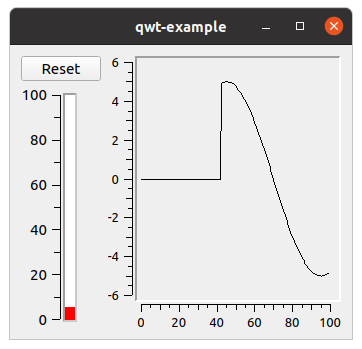

# QwtExample

A simple example program using QT and Qwt widgets.



## Required packages

Install the QT5 and Qwt development packages:

```
    apt-get install qtdeclarative5-dev-tools
    apt-get install libqwt-qt5-dev
```

## Build it

```
    cmake .
    make
```

## Run it

```
    ./qwt-example
```
